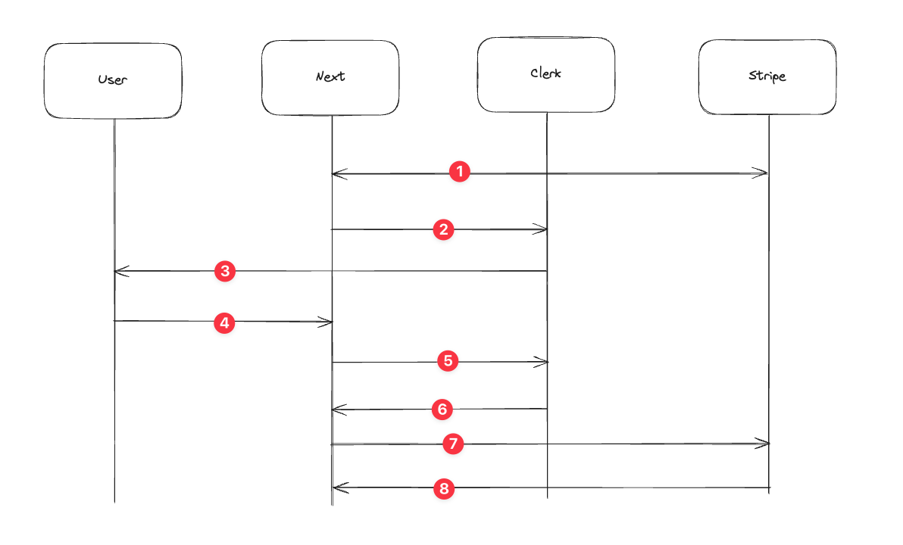

# Clerk x Stripe Integrated Form Demo

This demo shows how to create a fully custom form that integrates creating a Clerk user (using email OTP), select a subscription tier, and collect credit card information.

## How it works

This is built using [Custom Flows](https://clerk.com/docs/custom-flows/overview), [Stripe Elements](https://stripe.com/payments/elements), and Webhooks. The flow is as follows:

1. User hits submit and card is tokenized
2. Tokenized card data and price ID saved in unsafe metadata, Clerk validation begins
3. Clerk sends email with otp
4. User validates OTP
5. User is created
6. Webhook sent to Next app with user.created, incl unsafe metadata
7. Handler creates payment method, customer, and subscription
8. Customer is subscribed to product

Notable pages:

- `src/app/sign-up` - Contains sign up & validation pages.
- `src/app/after-sign-up` - This is where the user is redirected after signup. The page waits for the `stripeSubscriptionId` value, indicating that onboarding was successful.
- `src/api/clerkhooks` - The file that defines the webhook handlers to create a payment method, customer record, and subscription in Stripe.

## What is NOT covered in this demo

Input validation and general error handling is not complete in this demo. Please be sure to properly handle those before using this in production.